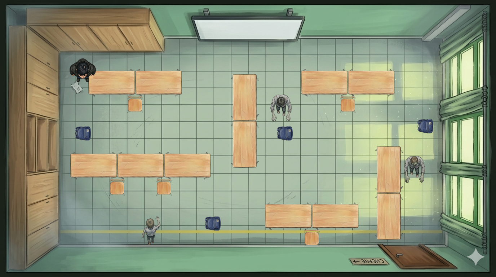

# Station 03 – Klassenraum (Minispiel: Labyrinth-Flucht)

**Deine Aufgabe:** Startbild und Sound generieren, dann das Labyrinth-Minispiel fertigbauen — alle Sprites liegen schon bereit!

---

## 3.1 🎨 Startbild mit Gemini generieren

> 📸 **Referenzfoto:** [`docs/03_klassenraum/klassenraum.jpg`](klassenraum.jpg) — das echte Schulgebäude mit dem orangenen Holzfassade und blauen Streben. **Lade es mit in Gemini hoch**, damit der Schauplatz wiedererkennbar bleibt.

> 📋 **Stil-Vorlage:** aus `docs/00_stil-vorlage.md` — immer ans Ende des Prompts, nie weglassen.

```
In the exact style of a LucasArts adventure game background:

Exterior establishing shot of a two-story German school building during a
zombie apocalypse — based exactly on the attached reference photo.
Match the architecture:
- Horizontal orange/amber wooden cladding panels covering the facade
- Bold vertical and horizontal blue trim framing the panels and window sections
- Large grid windows in two rows, warm orange wooden frames
- Flat paved schoolyard/courtyard in the foreground
- Dense green trees behind and around the building

Zombies are visible in silhouette through several windows on both floors,
pressing against the glass, hands on the panes. One window is cracked.
A schoolbag lies abandoned on the courtyard. The entrance door hangs ajar.

STYLE: Stylized painterly cartoon illustration, slightly brushy textures, high contrast,
clear silhouettes, dark but vibrant palette — dominated by mossy greens, moody greys,
warm amber accents. Inspired by LucasArts adventure game backgrounds, Tim Burton,
Goosebumps book covers, Hotel Transylvania. Spooky but kid-friendly (age 10–14).

ATMOSPHERE: Overcast sky with a sickly yellow-green tint. Low ground fog drifting
across the courtyard. Long diagonal shadows from the trees. Dried leaves swirling
in cold wind. Flickering classroom lights visible through the windows.
Subtle volumetric light cutting through the clouds.

TECHNICAL: 16:9 aspect ratio, 1280x720 resolution, slight low-angle shot looking
up at the building, sharp focus on the facade and windows, slight atmospheric
depth-of-field on the background trees.
No text, no speech bubbles, no UI overlays, no watermarks. No gore.
```

<details>
<summary>📖 Deutsche Übersetzung zum Verstehen (nicht in Gemini eingeben!)</summary>

```
Im exakten Stil eines LucasArts-Adventure-Hintergrundbilds:

Außenaufnahme eines zweistöckigen deutschen Schulgebäudes während einer
Zombie-Apokalypse — genau nach dem beigefügten Referenzfoto.
Architektur übernehmen:
- Horizontale orange/bernsteinfarbene Holzverkleidungspaneele an der Fassade
- Markante vertikale und horizontale blaue Streben, die Paneele und
  Fensterabschnitte rahmen
- Große Rasterförmige Fenster in zwei Reihen mit warmen orangen Holzrahmen
- Flacher gepflasterter Schulhof/Innenhof im Vordergrund
- Dichte grüne Bäume hinter und neben dem Gebäude

Zombies sind als Silhouetten durch mehrere Fenster beider Stockwerke sichtbar,
an die Scheiben gedrückt, Hände auf den Scheiben. Ein Fenster ist gerissen.
Eine Schultasche liegt verlassen auf dem Hof. Die Eingangstür steht einen
Spalt offen.

STIL: Stilisierte malerische Cartoon-Illustration, leicht pinselige Texturen,
hoher Kontrast, klare Silhouetten, dunkle aber kräftige Palette — dominiert
von moosigen Grüntönen, düsteren Grautönen, warmen Bernstein-Akzenten.
Inspiriert von LucasArts-Hintergrundbildern, Tim Burton, Goosebumps-Buchcovern,
Hotel Transylvania. Gruselig, aber kindgerecht (Alter 10–14).

ATMOSPHÄRE: Bewölkter Himmel mit krankhaft gelbem Grünton. Bodennaher Nebel
zieht über den Hof. Lange diagonale Schatten von den Bäumen. Trockene Blätter
wirbeln im kalten Wind. Flackernde Klassenzimmerlichten durch die Fenster
sichtbar. Leichte Lichtstrahlen brechen durch die Wolken.

TECHNISCH: 16:9-Seitenverhältnis, 1280x720 Auflösung, leichte Untersicht auf
das Gebäude, scharfer Fokus auf Fassade und Fenster, leichte atmosphärische
Tiefenunschärfe auf den Bäumen im Hintergrund.
Kein Text, keine Sprechblasen, keine UI-Overlays, keine Wasserzeichen.
Keine Gewaltdarstellung.
```

</details>

Speichere als `game/03_klassenraum/assets/klassenraum_intro.png`.

Falls das Bild noch nicht im Spiel angezeigt wird, lass Claude Code das übernehmen:
```
In game/scenes.js bei der Szene "klassenraum_intro":
Setze das image-Feld auf "03_klassenraum/assets/klassenraum_intro.png".
```

---

## 3.2 🎙️ Startbildschirm-Sound mit ElevenLabs vertonen

ElevenLabs **v3** versteht **Audio-Tags** in eckigen Klammern direkt im Text — sie steuern, wie die Stimme klingt (z. B. flüsternd, schreiend, keuchend).

Geh auf [elevenlabs.io](https://elevenlabs.io), stelle **Model = v3** ein, wähle die Stimme **„Commander Brake – Strict & Dominant"** und kopier diesen Text 1:1 rein:

```
[whispering] [breathing heavily] Sie haben dich aufgespürt.
[pause] [panicked] Die Tür fliegt auf!
[pause] [whispering] Komm durch — oder bleib für immer hier.
```

Speichere als `game/03_klassenraum/assets/klassenraum_voice_intro.mp3`.

Dann lass Claude Code den Ton einbauen:
```
In game/scenes.js bei der Szene "klassenraum_intro":
Füge ein audio-Feld hinzu mit Wert "03_klassenraum/assets/klassenraum_voice_intro.mp3".
Die Engine spielt das Audio dann automatisch beim ersten Aufruf ab und zeigt
einen Lautsprecher-Button neben dem Text.
```

---

## 3.3 🤖 Minispiel bauen mit Claude Code

So soll das Labyrinth-Minispiel aussehen — Tische als Wände, Zombies auf festen Routen, Alex muss durch zur Hintertür:



Öffne Claude Code im Projektordner `zombie-battle-royale` und paste diesen Prompt:

```
Ich baue ein Browser-Spiel (Vanilla JS, kein Framework).
Implementiere die Funktion startLabyrinth(onWin, onLose) in game/03_klassenraum/labyrinth.js.
Die Datei existiert schon als Stub — ersetze den Inhalt vollständig.

Das Minispiel läuft im Element #combat-area (1280x720px, position: relative).
Hintergrundbild: renderSceneImage("03_klassenraum/assets/klassenraum_kampf.png") — diese Funktion existiert in engine.js.

Spielmechanik — Kachel-Labyrinth (Top-down):
- Grid: 10 Spalten × 7 Zeilen. Kachelgröße: 128×100px (passt auf 1280x700px).
- Wände (Tische): tisch.png aus 03_klassenraum/assets/, skaliert auf eine Kachel.
- Spieler: ove_von_oben.png aus 03_klassenraum/assets/, startet auf Kachel (0,0) oben links.
- Ausgang: Kachel (9,6) unten rechts — markiert mit einem grünen Rahmen oder Pfeil-Div.
- 3 Zombies (zombie_oben_01/02/03.png aus 03_klassenraum/assets/) patrouillieren auf festen Routen:
  Zombie 1: bewegt sich horizontal auf Zeile 2 (links↔rechts, Schritt alle 900ms)
  Zombie 2: bewegt sich vertikal auf Spalte 5 (hoch↔runter, Schritt alle 1100ms)
  Zombie 3: bewegt sich horizontal auf Zeile 5 (links↔rechts, Schritt alle 800ms)
- Wand-Layout: Zeilen 1,3,5 haben abwechselnde Wand-Blöcke (Spalten 1,3,5,7 = Wand, Rest frei) — Zombie-Routen müssen auf freien Feldern liegen.
- Spieler bewegt sich mit WASD oder Pfeiltasten (ein Feld pro Tastendruck, keine Diagonale).
- Kollision Spieler↔Zombie → loseHeart(1) aus engine.js aufrufen, Spieler zurück zu (0,0).
- Spieler erreicht (9,6) → cleanup, onWin().
- Zeitlimit 30 Sekunden (nutze startTimer/stopTimer aus engine.js) — abgelaufen → cleanup, onLose().
- gameState.hearts === 0 → cleanup, onLose().

Schau dir game/05_basketballplatz/basketball.js als Muster für Aufbau und Cleanup an.
```

---

## 3.4 🎨 Siegbild mit Gemini generieren

> 📸 **Referenzfoto:** [`docs/03_klassenraum/klassenraum2.jpg`](klassenraum2.jpg) — Außenbereich hinter dem Schulgebäude: geschwungene Fassade mit vertikalen rotbraunen Holzlamellen, Baumstamm-Sitzbank auf sandigen Boden, alte Bäume. **Lade es mit in Gemini hoch.**

> 📋 **Stil-Vorlage:** aus `docs/00_stil-vorlage.md` — immer ans Ende des Prompts, nie weglassen.

```
In the exact style of a LucasArts adventure game background:

Outdoor area directly behind a German school building during a zombie
apocalypse — based exactly on the attached reference photo. Match the setting:
- A curved school building in the background with closely spaced vertical
  dark-red/brown wooden slats as a facade, large windows behind the slats
- Tall trees in the foreground, partially obscuring the building
- A rustic log bench made of natural tree trunks in the center foreground
- Sandy, leaf-covered ground

Alex has just burst through the emergency exit — the door behind is shut.
The area looks abandoned: a dropped schoolbag near the bench, a single
zombie shambling away in the far background between the trees, not yet
aware. A moment of eerie calm.

STYLE: Stylized painterly cartoon illustration, slightly brushy textures, high contrast,
clear silhouettes, dark but vibrant palette — dominated by mossy greens, moody greys,
warm amber accents. Inspired by LucasArts adventure game backgrounds, Tim Burton,
Goosebumps book covers, Hotel Transylvania. Spooky but kid-friendly (age 10–14).

ATMOSPHERE: Overcast sky with a sickly yellow-green tint filtering through the
tree canopy. Dried autumn leaves scattered on the sandy ground. Long diagonal
shadows from the trees. Low ground fog drifting between the trunks.
The curved building glows faintly from within — something still moving inside.

TECHNICAL: 16:9 aspect ratio, 1280x720 resolution, eye-level shot from just
outside the emergency exit, sharp focus on the bench and building facade,
slight atmospheric depth-of-field on the far background.
No text, no speech bubbles, no UI overlays, no watermarks. No gore.
```

<details>
<summary>📖 Deutsche Übersetzung zum Verstehen (nicht in Gemini eingeben!)</summary>

```
Im exakten Stil eines LucasArts-Adventure-Hintergrundbilds:

Außenbereich direkt hinter einem deutschen Schulgebäude während einer
Zombie-Apokalypse — genau nach dem beigefügten Referenzfoto.
Schauplatz übernehmen:
- Ein geschwungenes Schulgebäude im Hintergrund mit dicht gesetzten vertikalen
  dunkelroten/braunen Holzlamellen als Fassade, Fenster dahinter sichtbar
- Hohe Bäume im Vordergrund, die das Gebäude teilweise verdecken
- Eine rustikale Sitzbank aus Baumstämmen im vorderen Bildmittelgrund
- Sandiger, laubbedeckter Boden

Alex ist gerade durch den Notausgang gebrochen — die Tür dahinter ist zu.
Der Bereich wirkt verlassen: eine liegengelassene Schultasche neben der Bank,
ein einzelner Zombie schlurft weit hinten zwischen den Bäumen, noch nicht
aufmerksam. Ein Moment gespenstiger Ruhe.

STIL: Stilisierte malerische Cartoon-Illustration, leicht pinselige Texturen,
hoher Kontrast, klare Silhouetten, dunkle aber kräftige Palette — dominiert
von moosigen Grüntönen, düsteren Grautönen, warmen Bernstein-Akzenten.

ATMOSPHÄRE: Bedeckter Himmel mit krankhaft gelbgrünem Ton durch das Blätterdach.
Trockene Herbstblätter auf dem Sandboden. Lange diagonale Schatten der Bäume.
Bodennaher Nebel zwischen den Stämmen. Das geschwungene Gebäude leuchtet schwach
von innen — da bewegt sich noch etwas.

TECHNISCH: 16:9-Seitenverhältnis, 1280x720 Auflösung, Augenhöhe direkt vor
dem Notausgang, scharfer Fokus auf Bank und Gebäudefassade, leichte
atmosphärische Tiefenunschärfe im Hintergrund.
Kein Text, keine Sprechblasen, keine UI-Overlays, keine Wasserzeichen.
Keine Gewaltdarstellung.
```

</details>

Speichere als `game/03_klassenraum/assets/klassenraum_sieg.png`.

Falls das Bild noch nicht im Spiel angezeigt wird, lass Claude Code das übernehmen:
```
In game/scenes.js bei der Szene "klassenraum_sieg":
Setze das image-Feld auf "03_klassenraum/assets/klassenraum_sieg.png".
```

---

## 3.5 🎙️ Sieg-Ton mit ElevenLabs

Wieder **Model = v3** und Stimme **„Commander Brake – Strict & Dominant"** — kopier diesen Text rein:

```
[sighs] [breathing heavily] Letzte Lücke — du schlüpfst durch und wirfst die Brandschutztür ins Schloss. Dahinter: die Turnhalle!
[pause] [whispering] Kletterseile. Wenn du auf ein Dach kommst, bist du weg von hier.
```

Speichere als `game/03_klassenraum/assets/klassenraum_voice_sieg.mp3`.

Dann lass Claude Code den Ton einbauen:
```
In game/scenes.js bei der Szene "klassenraum_sieg":
Füge ein audio-Feld hinzu mit Wert "03_klassenraum/assets/klassenraum_voice_sieg.mp3".
```
